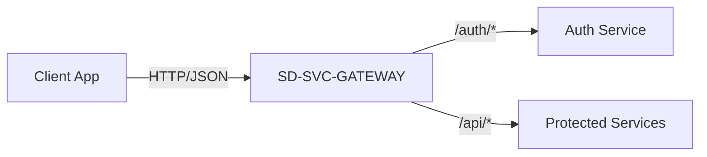

# Architecture

The **SD-SVC-GATEWAY** follows a standard API Gateway pattern. It sits between the client applications (web, mobile, etc.) and the internal microservices.

## High-Level Overview

## Core Components

### 1. Router
The router is built using the **Gin** web framework. It defines the URL patterns and maps them to specific handlers or proxies.
- **Public Routes**: Endpoints that do not require authentication (e.g., `/health`, `/auth/login`).
- **Protected Routes**: Endpoints under `/api` that require a valid JWT.

### 2. Middleware
Middleware functions are executed before the request reaches the final handler.
- **AuthMiddleware**: Extracts the `Authorization` header (Bearer token), validates the JWT using the configured secret, and injects user claims (`userID`, `email`) into the context.

### 3. Reverse Proxy
The gateway uses `httputil.NewSingleHostReverseProxy` to forward requests.
- **Dynamic Routing**: It rewrites the host and scheme to match the target service.
- **Path Forwarding**: It forwards the path suffix to the downstream service.

## Request Flow

1. **Incoming Request**: A client sends a request to the gateway (e.g., `GET /api/me`).
2. **Routing**: The gateway matches the path to a route definition.
3. **Middleware**:
   - If the route is protected, `AuthMiddleware` checks the token.
   - If invalid, a `401 Unauthorized` is returned.
4. **Handling**:
   - If it's a proxy route, the request is forwarded to the corresponding service.
   - If it's a direct handler (like `/health`), the gateway responds directly.
5. **Response**: The response from the downstream service (or the gateway itself) is sent back to the client.
